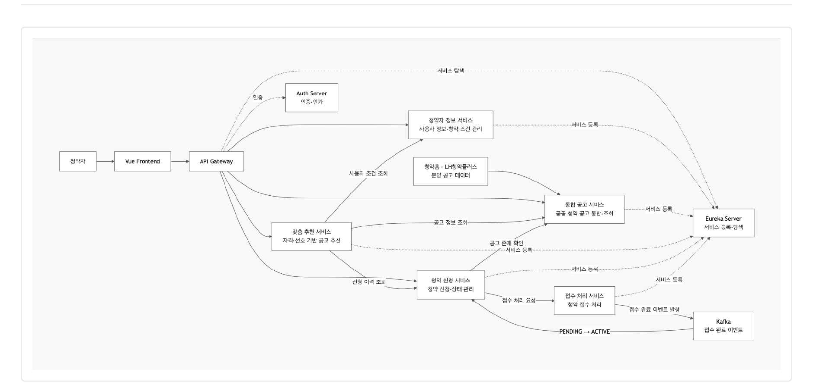
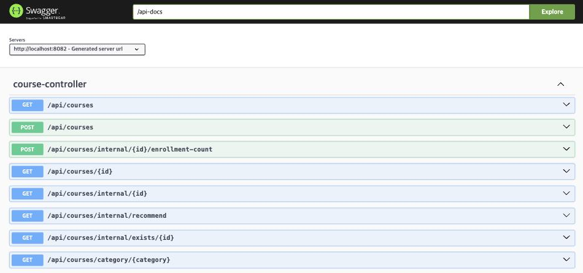
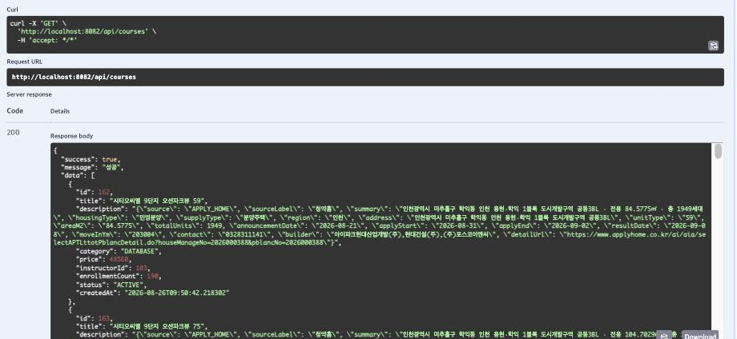

# 모아청약 — MSA 기반 고객 중심 서비스 보고서

**6반 6조 윤소영** · 담당: Backend (course-service)

---

# Chapter 1. 어떤 문제를 풀려고 했나, 왜 이 기술을 골랐나

## 1. 이해관계자의 문제에서 서비스 구성이 나왔다

현재 청약을 하려면 청약홈, LH청약플러스, 지역 공사 사이트를 각각 들어가야 합니다. 여기에 인기 단지 접수일에는 신청 기능에만 트래픽이 몰려 서비스 전체가 느려지는 문제도 있습니다.

기술을 먼저 고른 것이 아니라, 아래 표를 왼쪽에서 오른쪽으로 채워 가면서 서비스 구성이 나왔습니다. **이해관계자의 문제 → 그 문제를 풀 기능 → 기능을 맡을 서비스 → 이해관계자가 실제로 얻는 것** 순서입니다.

| 이해관계자 | 겪는 문제 | 필요한 기능 | 담당 서비스 | 이해관계자가 얻는 것 |
|---|---|---|---|---|
| 청약자 (C) | 기관별로 사이트가 나뉘어 한곳에서 비교할 수 없음 | 여러 기관 공고를 하나의 목록으로 통합 조회 | **course-service (담당)** | 세 사이트를 돌지 않고 한 화면에서 수도권 1,523건을 지역·가격으로 비교 |
| 청약자 (C) | 긴 공고문을 읽어야 하고 자격은 당첨 후에야 검증됨 | 사용자 조건과 공고 자격을 비교해 신청 가능 여부 안내 | recommend-service | 신청 전에 지원 가능 여부를 확인해 헛신청을 줄임 |
| 청약자 (C) | 공고마다 유리한 전형이 달라 고르기 어려움 | 조건 기반 맞춤 공고 추천 | recommend-service | 전체를 다 훑지 않고 본인 조건에 맞는 공고부터 확인 |
| 청약자 (C) | 신청 후 진행 상태를 알기 어려움 | 청약 신청과 접수 상태 조회 | enrollment · payment | 접수 처리 중 → 접수 완료를 내 신청내역에서 직접 확인 |
| 공공기관 (G) | 기관별로 각자 운영·홍보해야 함 | 통합 플랫폼을 통한 단일 창구 노출 | api-gateway | 별도 채널을 운영하지 않아도 통합 플랫폼 이용자에게 공고가 노출됨 |
| 운영자 | 접수일에만 트래픽이 몰림 | 신청 기능만 독립적으로 확장 | (MSA 구조 자체) | 신청 서비스만 늘리면 되니 전체를 증설하지 않아도 됨 |

플랫폼(B)이 공공기관(G)의 청약 정보를 통합해 국민(C)에게 제공하는 B2G2C 구조입니다. 저는 이 중 첫 줄에 해당하는 course-service를 맡아, 두 기관의 공고 데이터를 수집·정규화해서 DB에 넣고 조회 API로 제공하는 역할을 담당했습니다. 제가 한 일이 사용자에게 닿는 지점은 결국 표의 첫 줄 맨 오른쪽 한 문장입니다. 그래서 데이터를 얼마나 많이 넣었는지보다, 기관마다 다른 필드를 같은 형식으로 맞추는 정규화가 더 중요한 작업이었습니다. 형식이 어긋나면 통합 목록에서 비교 자체가 안 되기 때문입니다.

## 2. 매핑 포인트 — 강의 도메인을 청약 도메인으로

제공된 코드는 온라인 강의 수강신청 플랫폼이었습니다. 이걸 청약으로 바꾸는 게 첫 과제였는데, 저희는 DB구조를 변경할까 하다가 자칫 영향받는 여러 프로그램들에 오류가 날 수 있어 DB 구조를 바꾸지 않고 의미만 재해석하는 방법을 택했습니다.

**개념 매핑 (기능 단위)**

| 기존 템플릿 | 모아청약 |
|---|---|
| 강사 | 공공기관·정부 |
| 과목 등록 | 분양 공고 등록 및 통합 |
| 수강신청 | 청약 신청 |
| 결제 | 청약 접수 처리 |
| 수강 권한 노출 | 접수 완료 후 신청 상태 전환 및 내역 조회 |
| AI 기반 강좌 추천 | 사용자 조건 기반 AI 맞춤 공고 추천 |

**컬럼 매핑 (데이터 단위)** — 실제 값은 DB에 적재된 공고 한 건(`id = 2499`)에서 가져왔습니다.

| 원본 컬럼 (강의) | 모아청약 의미 | 실제 값 |
|---|---|---|
| `title` | 단지명 + 주택형 | 고덕강일 대성베르힐 84A |
| `category` | 공급 지역 (enum 재해석) | `SECURITY` = 서울 |
| `price` | 분양가 (만원 단위) | `98400` = 9억 8,400만원 |
| `instructor_id` | 공급기관 ID (→ `users.id`) | `103` = 포스코이앤씨 |
| `enrollment_count` | 청약 접수 건수 | `16258` |
| `description` | 부가 정보 (JSON) | 주소·주택형·전용면적·세대수·신청기간 |
| `enrollments.status` | 청약 신청 상태 | `PENDING` = 접수 처리 중 → `ACTIVE` = 접수 완료 |

`category`는 코드에 하드코딩된 enum이라 값을 추가할 수 없어서 기존 값 4개를 지역으로 재해석했습니다(`SECURITY`=서울 / `MOBILE`=경기 / `DATABASE`=인천 / `OTHER`=기타). 원문 값은 화면에 노출하지 않고 표현 계층에서만 "서울"로 바꿔 보여주기로 팀 규칙을 정했고, 덕분에 백엔드 코드를 고치지 않고도 도메인 의미를 바꿀 수 있었습니다.

## 3. 왜 이 기술들을 썼나

처음에는 서버를 여러 개로 나누는 이유를 몰랐습니다. 그런데 인기 단지 접수일에 신청 기능이 막혀도 공고 조회는 되어야 한다는 조건이 나왔고, 그러려면 두 기능이 다른 서버에 있어야 했습니다.

| 기술 | 왜 필요했나 | 이해관계자에게 돌아가는 것 |
|---|---|---|
| **MSA** | 접수 폭주 구간만 독립 확장, 한 서비스 장애가 전체로 번지지 않게 격리 | 접수일에 신청이 밀려도 다른 청약자는 공고 조회·비교를 계속할 수 있음 |
| **Eureka** | IP를 하드코딩하지 않고 서비스 이름으로 서로를 찾기 위해 | 서버를 늘리거나 재기동해도 사용자가 쓰는 주소는 그대로 |
| **API Gateway** | 프론트가 8개 서버 주소를 각각 알 필요 없이 한 곳(8080)으로만 요청. JWT 검증도 여기서 | 로그인 한 번으로 전체 기능 이용, 서비스마다 인증 검사가 빠져 남의 신청내역이 새는 일 방지 |
| **FastAPI** (추천만) | 추천은 머신러닝으로 확장할 영역이라 Python이 유리. 서비스가 분리돼 있으니 언어가 달라도 됨 | 추천 로직만 고쳐 배포해도 조회·신청은 멈추지 않음 |

**장애 격리 실험** — 정말 그런지 확인하려고 청약 서비스 컨테이너만 내려봤습니다.

```
docker stop lecture-enrollment      ← 청약 서비스만 중지
GET :8082/api/courses          →  200 OK, 1,523건 응답
GET :8083/api/enrollments/...  →  연결 실패
docker start 후 약 5초 뒤 정상 응답
```

청약 서비스가 중지된 상태에서도 공고 조회는 정상 응답했습니다. 위 표에서 MSA의 값으로 적은 "신청이 밀려도 조회는 계속된다"가 실제로는 이 결과입니다. 다만 로컬에서 컨테이너 하나를 내려본 것이라, 실제 트래픽 상황까지 확인한 것은 아닙니다.

---

# Chapter 2. MSA 구조와 API 흐름

## 1. 아키텍처 구성도와 서비스별 역할



요청은 Vue 프론트엔드에서 출발해 API Gateway를 거쳐 각 서비스로 갑니다. 모든 서비스는 자기 주소를 Eureka에 등록하고, 서로를 찾을 때도 Eureka를 씁니다.

| 서비스 | 포트 | 역할 |
|---|---|---|
| API Gateway | 8080 | 프론트엔드의 모든 요청을 각 마이크로서비스로 라우팅, JWT 검증 |
| User Service | 8081 | 청약 사용자 정보 관리 |
| **Course Service** | **8082** | **청약홈·LH청약플러스의 분양 공고 데이터를 통합 관리·조회 (담당)** |
| Enrollment Service | 8083 | 청약 신청 생성, 신청 내역 및 상태 관리 |
| Payment Service | 8084 | 청약 신청 이후의 접수 처리 담당 |
| Recommend Service | 8085 | 사용자 정보 및 신청 이력을 활용한 맞춤 공고 추천 |
| Auth Server / Eureka | 9000 / 8761 | 인증·인가 / 서비스 등록·디스커버리 |

## 2. course-service 요청 처리 흐름과 DB 경계

```
요청 → Gateway가 JWT 검증 → Eureka에서 COURSE-SERVICE 위치 조회
     → controller → service → repository(JPA) → DB
     → entity를 CourseResponse로 변환해 응답
```

저희는 DB를 하나만 썼습니다. 실습 환경이 MariaDB 컨테이너 하나라 8개 서비스가 같은 `lecture_db`를 보기 때문에 서비스마다 DB를 나누는 것까지는 하지 못했습니다.

대신 지킨 것은 접근 경계입니다. 각 서비스는 자기 테이블 하나만 엔티티로 갖고(`User` / `Course` / `Enrollment` / `Payment`), 남의 테이블은 직접 읽지 않고 API로 물어봅니다. 청약 서비스는 같은 DB에 붙어 있어서 `courses`를 바로 조회할 수 있는데도 그렇게 하지 않고 `CourseServiceClient`로 제 API를 호출합니다. 나중에 DB를 나눌 때 코드를 고치지 않아도 된다는 게 이유였는데, 다만 지금은 테이블 사이에 외래키가 걸려 있어 이 상태로는 나눌 수 없습니다.

## 3. API 명세

| 기능 | Method | URL | 역할 |
|---|---|---|---|
| **통합 공고 조회** | **GET** | **`/api/courses`** | **전체 분양 공고 조회** |
| **지역별 공고 조회** | **GET** | **`/api/courses/category/{category}`** | **선택 지역의 분양 공고 조회** |
| **공고 상세 조회** | **GET** | **`/api/courses/{id}`** | **선택한 공고 상세정보 조회** |
| 맞춤 공고 추천 | GET | `/api/recommend/{userId}` | 사용자 맞춤 공고 추천 |
| 청약 신청 | POST | `/api/enrollments` | 선택한 분양 공고에 청약 신청 |
| 내 신청내역 조회 | GET | `/api/enrollments/my` | 청약 신청 내역 및 접수 상태 확인 |

굵게 표시한 것이 제가 만든 course-service의 공개 API입니다. 이 외에 다른 서비스만 호출하는 내부 API가 4개 더 있습니다 — 공고 존재 검증(`/internal/exists/{id}`), 공고 상세(`/internal/{id}`), 접수 건수 증가(`/internal/{id}/enrollment-count`)는 Enrollment가, 추천 대상 조회(`/internal/recommend`)는 Recommend가 호출합니다.

API 명세서를 먼저 써놓으니 팀원들이 제 구현이 끝나기를 기다리지 않고 명세만 보고 각자 화면과 로직을 만들 수 있었습니다. API 명세가 문서가 아니라 팀원 사이의 약속에 가깝다고 느낀 부분입니다.

## 4. 요청 → 응답 실제 확인 (Swagger UI)



course-controller에 공개 API 4개와 내부 API 4개, 총 8개 API를 개발했습니다.



`GET /api/courses`를 Try it out → Execute로 실행한 결과입니다. 200 응답이 왔고 공통 응답 형식(`success` / `message` / `data`)에 맞춰 실제 DB 값이 반환됩니다. `category`는 `DATABASE`(=인천), `price`는 48560(=4억 8,560만원), `description`에는 청약홈 원본 필드가 JSON으로 보존돼 있습니다. Chapter 1에서 정리한 매핑이 실제 응답에 그대로 나타나는 것을 확인할 수 있습니다.

**서비스가 실제로 연결되는지도 확인했습니다.** 위 호출은 course-service를 직접 부른 것이라 서비스 간 연결까지는 보여주지 못해, 두 가지를 더 확인했습니다.

```
① Gateway 경유 (Sprint 완료 기준 ②)
   GET http://localhost:8080/api/courses  →  200 · success: true · 1,523건

② 다른 서비스가 내 내부 API를 호출한 기록 (enrollment-service 로그)
   [CourseServiceClient] 강의 상세 조회 성공 - courseId: 255
```

①은 프론트가 서비스 주소를 몰라도 8080 한 곳으로만 요청하면 된다는 것을, ②는 청약 서비스가 같은 DB에 붙어 있으면서도 제 API를 호출한다는 것을 보여줍니다. §2에서 설명한 접근 경계가 로그로 확인되는 지점입니다.

---

# Chapter 3. Agile — Sprint 1과 2를 왜 나눴나

## 1. 백로그 작성과 우선순위 기준

기능을 먼저 정하지 않고 고객 문제에서 역산해 할 일을 뽑았습니다. 고객 문제 3가지를 Epic 4개로 묶고, 그걸 User Story 19개로 쪼갰습니다(E1 통합 공고 조회 4개 / E2 AI 맞춤 추천 4개 / E3 청약 신청·접수 5개 / E4 사용자·화면·기반 6개).

2일 동안 4명이 19개를 다 할 수는 없어서, **① 가치(MoSCoW) → ② 의존성 → ③ 리스크 → ④ 크기** 순서로 기준을 적용해 16개를 두 스프린트에 배치하고 3개는 이월했습니다.

```
Sprint 1 = 한 줄이 끝까지 도는 최소 흐름
           로그인 → 공고 조회 → 청약 신청 → 내 신청내역 (데이터는 시드)
Sprint 2 = 그 줄을 굵게
           시드 → 실제 공공 API / PENDING → ACTIVE 상태 전이 / 기본추천 → 자격판정
```

## 2. Sprint 배치와 내 판단

Sprint 1과 Sprint 2에 각각 8개씩 배치했고 모두 완료했습니다. 제가 맡은 스토리는 Sprint 1에 BL-01 통합 공고 목록 조회·BL-02 공고 상세 조회, Sprint 2에 BL-04 청약홈·LH 공공 API 통합·BL-03 지역별 조회였습니다.

공공 API 연동(BL-04)은 꼭 필요한데도 Sprint 2로 미뤘습니다. 외부 기관 API는 실패 위험이 있어서, Sprint 1에서는 같은 형태의 시드 데이터로 조회 흐름을 먼저 완성시켰습니다. 그래야 공공 API가 안 되더라도 데모가 돌아갑니다. 위험한 걸 뒤로 미룬다기보다, 안전한 걸 먼저 세워두고 그 위에 올린다는 개념이었습니다.

완료 기준(DoD)은 ① Eureka에 UP ② Gateway(8080) 경유 200 응답 ③ 목데이터가 아닌 DB 실제 값 ④ 팀원 교차 확인으로 정했습니다.

## 3. SCRUM 회의를 통한 계획 변경

Sprint 1이 끝나고 각자 만든 걸 이어 붙였더니, 프론트가 신청 결과를 브라우저에 저장해두고 그것만 보여주고 있어서 서버에서 상태가 바뀌어도 화면은 그대로였습니다. 상태 이름도 서로 달랐습니다(프론트 `RECEIVED` vs 백엔드 `PENDING`).

이 문제 때문에 Sprint 2에 없던 항목이 새로 추가됐고, 상태 이름 변환 규칙을 확정했습니다. 계획을 세우고 실행하고 돌아보고 다시 계획하는 흐름이, 방법론을 따라 한 것이 아니라 시간이 부족해서 자연스럽게 만들어졌습니다.

---

# Chapter 4. 담당 파트 — course-service 개발 내용

## 1. 공고 1,523건 적재와 정규화

`courses.instructor_id`가 `users`를 참조하기 때문에 공급기관 5곳(LH, 경기주택도시공사, 포스코이앤씨, 지에스건설, 대우건설)을 먼저 넣어야 공고가 들어갔습니다. 테이블을 만드는 것과 데이터를 넣는 것이 다른 일이고, 데이터를 넣는 데도 순서가 있다는 것을 여기서 알게 됐습니다.

수도권 공고를 수집한 결과는 경기 982 / 서울 292 / 인천 249, 총 1,523건입니다. 그런데 두 기관의 응답 형태가 서로 달라 맞추는 작업이 필요했습니다.

| | 청약홈 | LH |
|---|---|---|
| 응답 형태 | `{"data": [...]}` | 2원소 배열, 실제 데이터는 두 번째의 `dsList` |
| 데이터 단위 | 주택형별 (1,454행 / 282개 공고) | 공고별 (69행 / 69개 공고) |
| 주택형·면적·세대수·분양가 | 있음 | 없음 |
| 지역 필드명 | `SUBSCRPT_AREA_CODE_NM` | `CNP_CD_NM` |

기관별로 파서를 따로 만들고 결과를 같은 형태로 맞춰 저장했으며, `title` 기준으로 중복을 걸러 스크립트를 여러 번 실행해도 데이터가 중복되지 않게 했습니다. "여러 기관 데이터를 통합한다"는 기획 한 줄이 실제로는 기관 수만큼의 파서와 하나의 정규화 규칙을 의미한다는 걸 알게 됐습니다.

**이 작업으로** 청약자는 청약홈과 LH를 각각 방문하지 않고 한 목록에서 수도권 공고 1,523건을 볼 수 있고, 공고가 어느 기관에서 왔는지 신경 쓰지 않고 같은 기준(지역·분양가·주택형)으로 비교할 수 있게 됐습니다.

## 2. LH 공고에 주택형 정보가 없던 문제

LH 공고 69건이 전부 분양가 0원이었습니다. 처음엔 분양가 파싱을 잘못한 줄 알았는데, 주택형·전용면적·세대수·분양가 네 가지가 모두 비어 있었습니다.

원인은 위에서 본 데이터 단위 차이였습니다. LH 목록 API는 공고 단위라 주택형이라는 개념 자체가 없고, 그래서 주택형에 딸린 값들도 함께 없었습니다. **분양가 0원은 원인이 아니라 결과였습니다.**

같은 단지가 청약홈에도 올라온다는 점을 이용해 단지명으로 매칭해 값을 채웠습니다. 69건 중 56건을 보완했고 13건은 채우지 못했는데, 못 채운 건은 "공가세대 일반매각" 같은 공고라 청약홈에 대응하는 공고가 없었습니다. 보완한 뒤에도 LH는 공고당 한 행이라 주택형은 `59A, 59B`처럼 목록으로 넣었고, 청약홈처럼 주택형별로 쪼개지는 못했습니다.

**이 보완으로** LH 공고 56건이 분양가와 주택형을 갖게 됐습니다. 그 전에는 분양가가 0원으로 보여 비교 자체가 불가능했는데, 이제 청약홈 공고와 같은 기준으로 나란히 놓고 볼 수 있습니다.

## 3. 접수 건수 편차 부여

공공 API가 접수 건수를 주지 않아 1,523건 전부 0이었습니다. 추천 서비스가 이 값으로 정렬하는데 전부 같으면 순위가 나오지 않습니다.

공급 세대수에 지역별 경쟁률을 곱해 값을 넣었고, 결과적으로 서울은 미달이 없고 인천은 6건이 미달인데 실제 청약 경향과 비슷하게 나왔습니다. 여기서 신경 쓴 건 `RAND()`를 쓰지 않은 것입니다. 실행할 때마다 값이 바뀌면 발표 중 재적재 시 캡처와 화면이 달라지므로, `CRC32(title)` 해시를 써서 몇 번을 실행해도 같은 값이 나오게 했습니다.

**이 작업으로** 공고마다 경쟁률이 달라져 추천 서비스가 "어느 공고에 사람이 덜 몰리는지"를 구분할 수 있게 됐고, 청약자는 당첨 확률이 높은 공고를 가려낼 근거를 갖게 됐습니다.

## 4. 안 쓰이게 된 API에서 배운 것

추천용으로 만든 `/internal/recommend`는 결국 쓰이지 않았습니다. 추천 서비스가 공개 목록 API를 쓰고 정렬은 자기가 하는 쪽으로 정리됐기 때문입니다.

아쉬웠지만 생각해보니 이쪽이 맞습니다. 제 API가 "접수 많은 순"으로 정렬해서 줬는데 청약에서는 접수가 많으면 당첨 확률이 낮다는 뜻이라 기준이 반대여야 합니다. 정렬을 제가 쥐고 있으면 추천 정책이 바뀔 때마다 제 코드를 고쳐야 합니다. **정렬 기준은 그걸 쓰는 쪽이 갖는 게 낫다**는 걸 안 쓰이게 된 API를 보고 알았습니다. 서비스 경계를 어디에 그어야 하는지 처음으로 구체적으로 느낀 부분입니다.

---

# Chapter 5. 트러블슈팅 사례 정리

## 1. 시드 SQL을 고쳤는데 반영이 안 됨

- 증상: 파일을 수정하고 재기동해도 예전 데이터가 그대로 나왔습니다.
- 원인: `down`만 해서 MariaDB 볼륨이 남아 있었습니다. 초기화 스크립트는 데이터 폴더가 비어 있을 때만 실행됩니다.
- 해결: 초기에는 `down -v`로 초기화했고, 팀 작업이 시작된 뒤로는 실행 중인 DB에 직접 반영하는 방식으로 바꿨습니다.
- 배운 점: 혼자 쓸 때 편한 명령이 같이 쓸 때는 위험할 수 있다는 것을 알게 됐습니다.

## 2. 404와 405가 500으로 응답됨

- 증상: 없는 id를 조회해도, 없는 URL을 불러도, 메서드를 틀려도 전부 500이 반환됐습니다.
- 처음에는 서비스가 내려갔거나 DB 연결이 끊긴 줄 알았습니다.
- 원인: `GlobalExceptionHandler`의 `@ExceptionHandler(Exception.class)`가 Spring이 알아서 처리하던 예외까지 잡아 500으로 바꾸고 있었습니다. 로그도 남기지 않아 원인을 찾기 어려웠습니다.
- 해결: 404·405는 원래 상태 코드를 유지하도록 수정하고, 조회 실패 전용 예외(`CourseNotFoundException`)를 만들어 400과 구분했으며, 에러 로그를 추가했습니다.
- 배운 점: API 명세에 404라고 써놓고 실제로 500이 나가면 그 API를 쓰는 팀원이 잘못 분기하게 됩니다.

## 3. 인증키를 넣었는데 인증 실패

- 증상: 발급받은 공공데이터 키를 그대로 넣었는데 인증 오류가 났습니다.
- 원인: 포털이 Encoding 키와 Decoding 키를 둘 다 주는데, 코드에서는 Decoding 키를 써야 합니다. Encoding 키를 쓰면 한 번 더 인코딩되어 값이 달라집니다.
- 해결: Decoding 키로 교체했습니다.
- 배운 점: "키가 틀렸다"는 에러가 키 값이 아니라 인코딩 처리 문제일 수 있다는 것을 알게 됐습니다.

## 4. 화면과 서버의 상태가 서로 다름

- 증상: 서버에서 상태가 `ACTIVE`로 바뀌었는데 화면은 그대로였습니다.
- 원인: 프론트가 신청 결과를 브라우저에 저장해두고 그것만 보여주고 있었습니다. 상태 이름도 서로 달랐습니다(프론트 `RECEIVED` vs 백엔드 `PENDING`).
- 해결: 회의에서 문제를 제기해 Sprint 2에 항목을 신설했습니다. 화면이 서버를 직접 조회하도록 바꾸고, DB와 코드는 그대로 두고 화면에서만 상태 이름을 변환하도록 했습니다.
- 배운 점: 각자 파트가 동작해도 이어 붙이면 안 맞을 수 있습니다. 이런 문제는 개인 작업에서는 보이지 않습니다.

---

# 마무리 — 배운 것과 남은 것

**MSA와 Agile을 적용해 보는 실습이긴 했지만, 실제로 주어진 기한이 이틀로 매우 타이트했기 때문에 저절로 적용할 수밖에 없는 방법이었습니다.** 접수는 몰리고 조회는 계속돼야 한다는 조건에서 서비스를 나눌 이유가 나왔고, 하고 싶은 기능 19개를 다 할 수 없으니 기준을 정해 자르고 스프린트로 나눌 수밖에 없었습니다.

DB 작업은 테이블을 만드는 일이라고 생각했는데, 실제로는 순서와 제약과 재현성을 관리하는 일에 가까웠습니다. 외래키 때문에 넣는 순서가 정해졌고, 시드는 여러 번 돌려도 같은 결과가 나와야 해서 `RAND()` 대신 해시를 썼습니다.

가장 오래 고민한 것은 스키마를 바꿀지 말지였습니다. 청약 도메인에는 공급 세대수 같은 값이 필요한데 제공된 테이블에는 그 컬럼이 없었고, 저는 `description`에 JSON으로 넣는 쪽을 택했습니다. 대가도 있었습니다. JSON 안의 값은 인덱스를 탈 수 없어 세대수로 정렬하거나 거르는 조건을 DB에 맡길 수 없습니다. 지금은 1,523건이라 괜찮지만 데이터가 늘면 달라집니다.

이걸 정리하면서 **"안 됐다"와 "안 하기로 했다"가 다르다**는 걸 느꼈습니다. 처음에는 스키마 제약 때문에 못 했다고 적으려 했는데, 실제로는 인덱스를 포기하는 대신 팀 일정을 지키기로 판단한 것이었습니다.

**남은 개선 과제**

- 공공 API를 스케줄러로 주기 동기화 (지금은 수동 배치)
- 공급 세대수·신청 마감일을 정식 컬럼으로 올려 인덱스 적용
- LH 공고를 청약홈처럼 주택형별로 분리
- 서비스별 DB 분리 / 내부 API에 서비스 간 인증 추가
